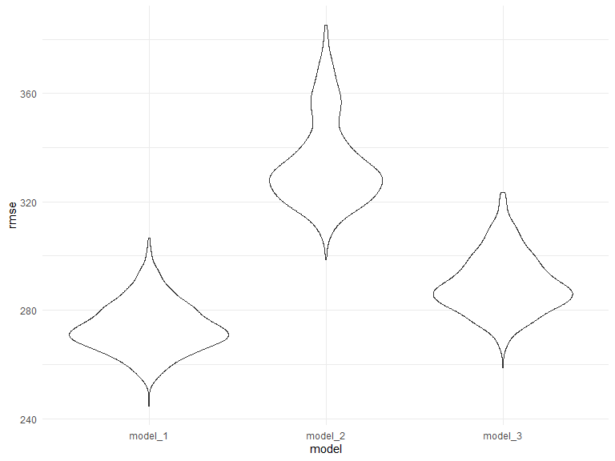

Homework 6
================
Alexis Colangelo
11/17/2019

# Problem 1

## Load and clean the data for regression analysis:

``` r
birthweight_data = read_csv(file = "./data/birthweight.csv") %>%
  mutate(
    babysex = 
      recode(babysex, "1" = "male", "2" = "female"),
      babysex = factor(babysex),
    fincome = factor(fincome),
    frace = 
      recode(frace, "1" = "white", "2" = "black", 
             "3" = "asian", "4" = "puerto_rican", 
             "8" = "other", "9" = "unknown"),
      frace = factor(frace),
    malform = 
      recode(malform, "0" = "absent", "1" = "present"),
      malform = factor(malform),
    mrace =
      recode(mrace, "1" = "white", "2" = "black",
             "3" = "asian", "4" = "puerto_rican",
             "8" = "other"),
      mrace = factor(mrace)
  ) %>% view()
```

    ## Parsed with column specification:
    ## cols(
    ##   .default = col_double()
    ## )

    ## See spec(...) for full column specifications.

There are no missing data in this datset:

``` r
table(is.na(birthweight_data))
```

    ## 
    ## FALSE 
    ## 86840

## Propose a regression model for birthweight. This model may be based on a hypothesized structure for the factors that underly birthweight, on a data-driven model-building process, or a combination of the two.

``` r
model_1 = step(lm(bwt ~., data = birthweight_data), direction = "backward")
```

    ## Start:  AIC=48726.46
    ## bwt ~ babysex + bhead + blength + delwt + fincome + frace + gaweeks + 
    ##     malform + menarche + mheight + momage + mrace + parity + 
    ##     pnumlbw + pnumsga + ppbmi + ppwt + smoken + wtgain
    ## 
    ## 
    ## Step:  AIC=48726.46
    ## bwt ~ babysex + bhead + blength + delwt + fincome + frace + gaweeks + 
    ##     malform + menarche + mheight + momage + mrace + parity + 
    ##     pnumlbw + pnumsga + ppbmi + ppwt + smoken
    ## 
    ## 
    ## Step:  AIC=48726.46
    ## bwt ~ babysex + bhead + blength + delwt + fincome + frace + gaweeks + 
    ##     malform + menarche + mheight + momage + mrace + parity + 
    ##     pnumlbw + ppbmi + ppwt + smoken
    ## 
    ## 
    ## Step:  AIC=48726.46
    ## bwt ~ babysex + bhead + blength + delwt + fincome + frace + gaweeks + 
    ##     malform + menarche + mheight + momage + mrace + parity + 
    ##     ppbmi + ppwt + smoken
    ## 
    ##            Df Sum of Sq       RSS   AIC
    ## - fincome  11   1032481 320917792 48718
    ## - frace     4    110592 319995902 48720
    ## - malform   1      1066 319886376 48724
    ## - ppbmi     1      7673 319892984 48725
    ## - momage    1     27509 319912819 48725
    ## - mheight   1     69375 319954685 48725
    ## - menarche  1    113786 319999096 48726
    ## - ppwt      1    134233 320019543 48726
    ## <none>                  319885310 48726
    ## - parity    1    390462 320275772 48730
    ## - mrace     3    903296 320788606 48733
    ## - babysex   1    815031 320700341 48736
    ## - gaweeks   1   4563782 324449092 48786
    ## - smoken    1   4926043 324811353 48791
    ## - delwt     1   7982076 327867387 48831
    ## - blength   1 101696901 421582211 49923
    ## - bhead     1 106325455 426210766 49970
    ## 
    ## Step:  AIC=48718.45
    ## bwt ~ babysex + bhead + blength + delwt + frace + gaweeks + malform + 
    ##     menarche + mheight + momage + mrace + parity + ppbmi + ppwt + 
    ##     smoken
    ## 
    ##            Df Sum of Sq       RSS   AIC
    ## - frace     4    125317 321043108 48712
    ## - malform   1       794 320918586 48716
    ## - ppbmi     1      7737 320925529 48717
    ## - momage    1     73248 320991040 48717
    ## - mheight   1     74558 320992349 48717
    ## - menarche  1    128302 321046094 48718
    ## - ppwt      1    137321 321055113 48718
    ## <none>                  320917792 48718
    ## - parity    1    394386 321312178 48722
    ## - mrace     3    892383 321810174 48725
    ## - babysex   1    849204 321766995 48728
    ## - gaweeks   1   4650200 325567992 48779
    ## - smoken    1   5131761 326049553 48785
    ## - delwt     1   7982819 328900611 48823
    ## - blength   1 101858710 422776502 49913
    ## - bhead     1 106986548 427904340 49966
    ## 
    ## Step:  AIC=48712.14
    ## bwt ~ babysex + bhead + blength + delwt + gaweeks + malform + 
    ##     menarche + mheight + momage + mrace + parity + ppbmi + ppwt + 
    ##     smoken
    ## 
    ##            Df Sum of Sq       RSS   AIC
    ## - malform   1       826 321043934 48710
    ## - ppbmi     1      8384 321051493 48710
    ## - momage    1     73313 321116422 48711
    ## - mheight   1     77245 321120354 48711
    ## - menarche  1    133333 321176441 48712
    ## - ppwt      1    140054 321183163 48712
    ## <none>                  321043108 48712
    ## - parity    1    395464 321438572 48715
    ## - babysex   1    847776 321890885 48722
    ## - gaweeks   1   4664176 325707284 48773
    ## - smoken    1   5089715 326132823 48778
    ## - delwt     1   7983432 329026540 48817
    ## - mrace     3  15950616 336993724 48917
    ## - blength   1 101803844 422846952 49906
    ## - bhead     1 107130616 428173724 49960
    ## 
    ## Step:  AIC=48710.15
    ## bwt ~ babysex + bhead + blength + delwt + gaweeks + menarche + 
    ##     mheight + momage + mrace + parity + ppbmi + ppwt + smoken
    ## 
    ##            Df Sum of Sq       RSS   AIC
    ## - ppbmi     1      8344 321052278 48708
    ## - momage    1     73594 321117529 48709
    ## - mheight   1     77092 321121026 48709
    ## - menarche  1    133569 321177503 48710
    ## - ppwt      1    139994 321183928 48710
    ## <none>                  321043934 48710
    ## - parity    1    395339 321439273 48713
    ## - babysex   1    847181 321891115 48720
    ## - gaweeks   1   4663378 325707312 48771
    ## - smoken    1   5089603 326133537 48776
    ## - delwt     1   7997809 329041743 48815
    ## - mrace     3  15959023 337002958 48915
    ## - blength   1 101818263 422862197 49904
    ## - bhead     1 107139909 428183843 49959
    ## 
    ## Step:  AIC=48708.27
    ## bwt ~ babysex + bhead + blength + delwt + gaweeks + menarche + 
    ##     mheight + momage + mrace + parity + ppwt + smoken
    ## 
    ##            Df Sum of Sq       RSS   AIC
    ## - momage    1     74812 321127090 48707
    ## - menarche  1    135540 321187818 48708
    ## <none>                  321052278 48708
    ## - parity    1    393656 321445934 48712
    ## - babysex   1    845781 321898059 48718
    ## - mheight   1   1162393 322214671 48722
    ## - ppwt      1   2938184 323990462 48746
    ## - gaweeks   1   4660715 325712993 48769
    ## - smoken    1   5094409 326146686 48775
    ## - delwt     1   7993099 329045377 48813
    ## - mrace     3  15961539 337013817 48913
    ## - blength   1 101826436 422878713 49902
    ## - bhead     1 107297173 428349451 49958
    ## 
    ## Step:  AIC=48707.28
    ## bwt ~ babysex + bhead + blength + delwt + gaweeks + menarche + 
    ##     mheight + mrace + parity + ppwt + smoken
    ## 
    ##            Df Sum of Sq       RSS   AIC
    ## - menarche  1    104958 321232048 48707
    ## <none>                  321127090 48707
    ## - parity    1    418790 321545880 48711
    ## - babysex   1    830530 321957620 48716
    ## - mheight   1   1169959 322297049 48721
    ## - ppwt      1   2863389 323990479 48744
    ## - gaweeks   1   4750701 325877791 48769
    ## - smoken    1   5111471 326238561 48774
    ## - delwt     1   7918641 329045731 48811
    ## - mrace     3  18603255 339730345 48946
    ## - blength   1 101753929 422881019 49900
    ## - bhead     1 107432298 428559388 49958
    ## 
    ## Step:  AIC=48706.7
    ## bwt ~ babysex + bhead + blength + delwt + gaweeks + mheight + 
    ##     mrace + parity + ppwt + smoken
    ## 
    ##           Df Sum of Sq       RSS   AIC
    ## <none>                 321232048 48707
    ## - parity   1    409921 321641969 48710
    ## - babysex  1    835357 322067406 48716
    ## - mheight  1   1101755 322333803 48720
    ## - ppwt     1   2856162 324088210 48743
    ## - gaweeks  1   4736922 325968970 48768
    ## - smoken   1   5141800 326373848 48774
    ## - delwt    1   8055856 329287904 48812
    ## - mrace    3  18642164 339874212 48946
    ## - blength  1 101951396 423183445 49902
    ## - bhead    1 107346359 428578408 49957

By using the backwards elimination method, the regression model I
propose is: bwt = babysex + bhead + blength + delwt + gaweeks + mheight
+ mrace + parity + ppwt +
smoken

## Describe your modeling process and show a plot of model residuals against fitted values – use add\_predictions and add\_residuals in making this plot.

The backwards elimination procedure starts with the full model and the
least significant variables. According to the scatterplot, we can see
that the residuals are pretty evenly spread out around zero, but there
are some outliers.

``` r
model_1_data =
    birthweight_data %>% 
    select(
     babysex, bhead, blength, delwt, gaweeks, mheight, 
     mrace, parity, ppwt, smoken, bwt) 

model_1_plot =
  model_1_data %>%
  modelr::add_residuals(model_1) %>%
  modelr::add_predictions(model_1) %>%
  ggplot(aes(x = pred, y = resid)) + geom_point()

model_1_plot
```


## Compare your model to two others:

  - One using length at birth and gestational age as predictors (main
    effects only)
  - One using head circumference, length, sex, and all interactions
    (including the three-way interaction) between these

Model 2 and 3 corresponding respectively to the above bullets:

``` r
model_2 = lm(bwt ~ blength + gaweeks, birthweight_data)
model_3 = lm(bwt ~ bhead + blength + babysex + 
               bhead * blength + 
               bhead * babysex +
               blength * babysex + 
               bhead * blength * babysex, birthweight_data)
```

Make this comparison in terms of the cross-validated prediction error;
use crossv\_mc and functions in purrr as appropriate.

``` r
cv_bwt =
  crossv_mc(birthweight_data, 500) %>%
  mutate(
    train = map(train, as_tibble),
    test = map(test, as_tibble)
  )


cv_bwt = 
  cv_bwt %>% 
  mutate(
    model_1  = map(train, ~lm(bwt ~ babysex + bhead + blength + delwt + 
                  gaweeks + mheight + mrace + parity + ppwt + smoken, data = .x)),
    model_2 = map(train, ~lm(bwt ~ blength + gaweeks, data = .x)),
    model_3  = map(train, ~lm(bwt ~ bhead + blength + babysex + bhead * blength + 
               bhead * babysex +blength * babysex + bhead * blength * babysex, 
               data = .x))) %>% 
  
  mutate(
    rmse_model_1 = map2_dbl(model_1, test, ~rmse(model = .x, data = .y)),
    rmse_model_2 = map2_dbl(model_2, test, ~rmse(model = .x, data = .y)),
    rmse_model_3 = map2_dbl(model_3, test, ~rmse(model = .x, data = .y)))

cv_bwt %>% 
  select(starts_with("rmse")) %>% 
  pivot_longer(
    everything(),
    names_to = "model", 
    values_to = "rmse",
    names_prefix = "rmse_") %>% 
  mutate(model = fct_inorder(model)) %>% 
  ggplot(aes(x = model, y = rmse)) + geom_violin()
```



As we can see from the violin plot, by comparing all three of the
models’ root mean squared errors, it looks like model 1 (proposed
model) sits the lowest on the graph, making it a better fit according to
prediction error distributions. The next best model is model\_3
(interaction effects).
